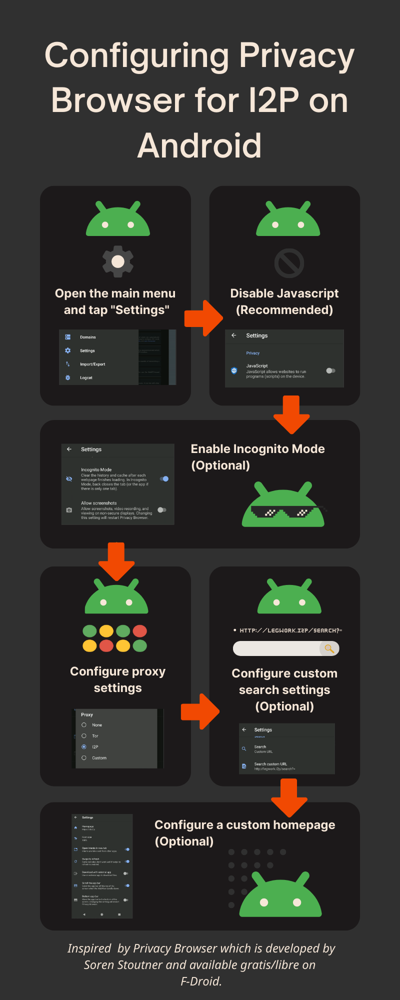

# Configuring-Privacy-Browser-for-I2P-on-Android

Configuring an I2P Browser on Android consistently has not always been easy.
After evaluating many approaches, the one which I believe is easiest at this time
is represented by Privacy Browser which is developed by Soren Stoutner and
available gratis/libre on F-Droid.

## 1. Open the main menu and tap "Settings"

 

## 2. Disable Javascript(Recommended)

## 3. Enable Incognito Mode(Optional)

## 4. Configure proxy settings

## 5. Configure custom search settings(Optional)

For your convenience, you can copy-and-paste from here:

 - `http://legwork.i2p/search?=`

## 6. Configure a custom homepage(Optional)

## Download and share this infographic with others:

- 