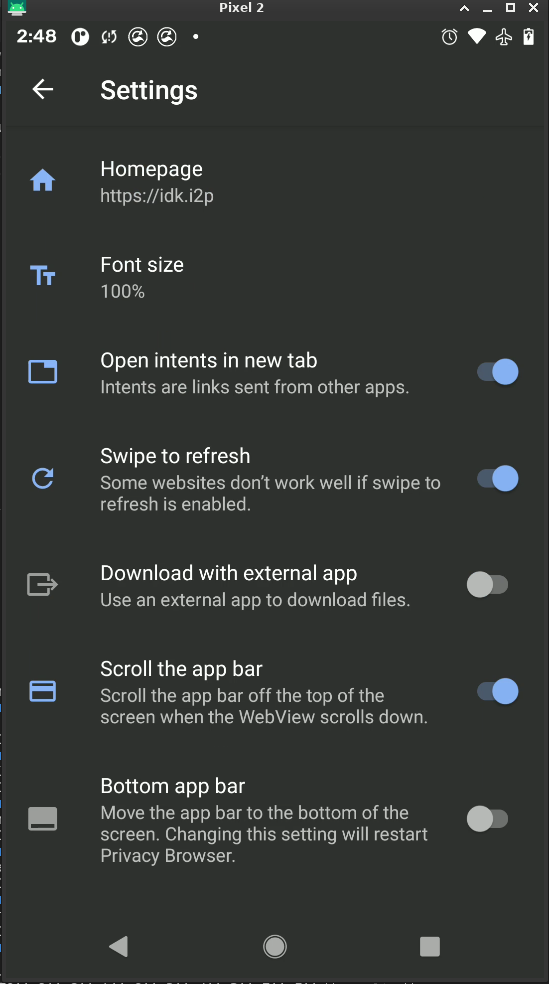

# Configuring-Privacy-Browser-for-I2P-on-Android

Configuring an I2P Browser on Android consistently has not always been easy.
After evaluating many approaches, the one which I believe is easiest at this time
is represented by Privacy Browser which is developed by Soren Stoutner and
available gratis/libre on F-Droid. 

1.  Open the main menu and tap "Settings"
2.  Disable Javascript(Recommended)
3.  Enable Incognito Mode(Optional)
4.  Configure proxy settings
5.  Configure custom search settings(Optional)
6.  Configure a custom homepage(Optional)